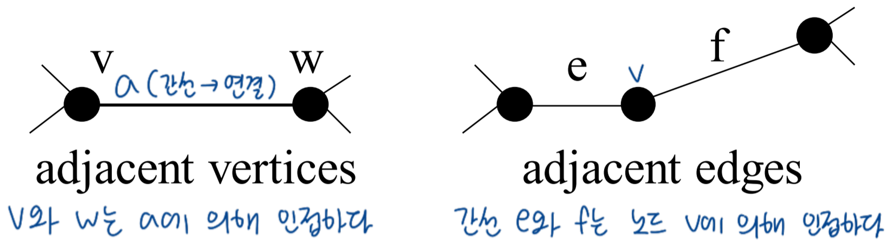

# 1. Graph

- $G=(V, E)$ → Simple 그래프

  - self loop (X)
  - multiple edge (X) → 같은 방향 edge 여러 개  
     
  - edge : 방향/무방향 → (u, v)=(v, u) / <u, v>≠<v, u>
  - weight : 가중치/무가중치
  - Dense/Sparse

 

- 연결 그래프: 어떤 한 쌍의 노드를 봐도 단순 경로 존재
  - 방향 연결 그래프: Strongly Connected
  - $|E|≥|V|-1$ ( |E|=|V|-1 → 트리 )

 

- 단순 경로: 출발점, 목적지 제외 중복 X
  - P → Q → T → S : 단순 경로 O
  - P → Q → T → Q → S : 단순 경로 X
  - P → Q → T → P : 단순 경로 O (사이클)

 

- Degree (차수): 노드와 연결된 간선 개수
- Adjacency (인접)
  

 

> 증명: Handshaking lemma (악수 정리)  
> 어떤 그래프 $G=(V, E)$에 대해 임의의 정점 v의 차수를 deg(v)라고 할 때,  
> 그래프의 차수의 합은 2×|E|이다. (edge 개수는 정수)
>
> 어떤 그래프의 홀수 차수의 노드 수는 짝수이다.

- 인접 리스트

  - memory : $O(n+m)$ → n: 모든 노드 개수, m: 모든 인접 노드 개수 == edge 개수
    - 방향 그래프 용량: $O(V+E)$
      → $\sum_{v\epsilon V}^{}outdeg(v)=|E|$
    - 무방향 그래프 용량: $O(V+E)$
      → $\sum_{v\epsilon V}^{}deg(v)=2|E|$
  - v에 인접한 모든 노드 : $O(deg(v))$ → 해당 노드의 인접 노드 모두 확인
  - $(u, v) ∈ E$ (존재 검사) : $O(deg(v))$ → 해당 노드의 인접 노드 모두 확인

 

- 인접 배열
  - memory : $O(n^2)$ → 2차원 배열 (n×n)
  - v에 인접한 모든 노드 : $O(n)$ → 한 행 다 읽음
  - $(u, v) ∈ E$ (존재 검사) : $O(1)$ → G[u][v]>0 확인
