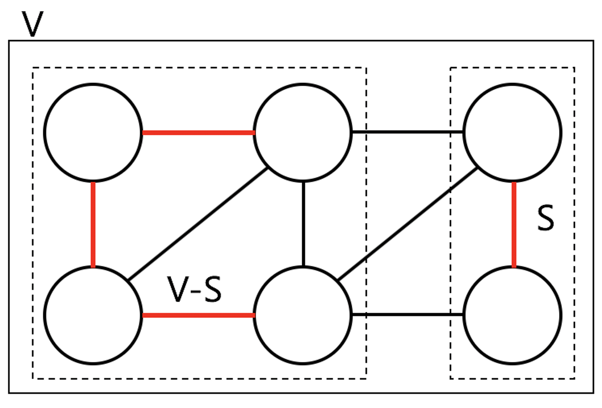
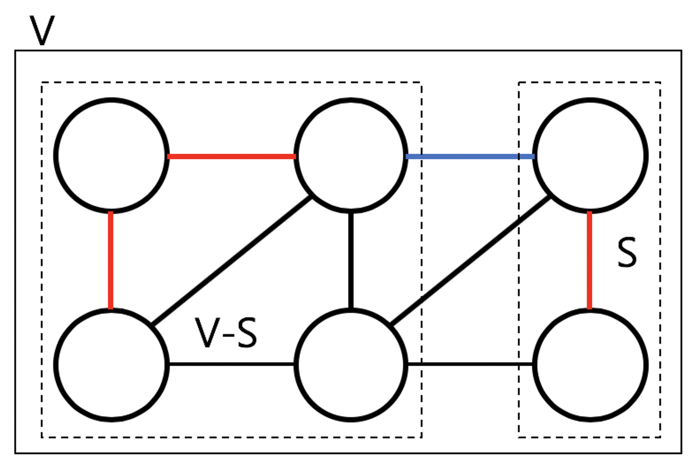

# 2. MST (Minimum Spanning Trees: 최소 신장 트리)

> Kruskal (크루스칼), Prim (프림)

- $G=(V, E)$

  - 방향/무방향 그래프
  - 가중치 그래프 → $(u, v) ∈ E$

<br>

- $T⊆G$

  - Spanning Tree (최대 $2^n-1$개)
    - 그래프의 모든 노드를 연결하는 서브 트리
  - MST : Spanning Tree 중 모든 edge의 가중치 합이 최솟값인 트리 - 여러 개 중 1개만 구하면 O

<br>

- 용어
  - cut : 노드 집합 (V) → S, S-V로 나눔
  - cross edge : (u, v) → u는 S에 v는 S-V에 속함
  - respect : MST의 부분 집합 A에 대해 cross edge 없음
    
  - light edge : cross edge 중 가중치 최소
  - safe edge : S, V-S가 A를 respect → light edge (u, v)는 A의 safe edge
    
    ⇒ safe edge 연결 → MST 생성

<br>

- Optimal Substructure (최적 부분 구조) 만족
  - 어떤 문제의 최적해가 그 부분 문제들의 최적해들로 구성
  - optimal 트리는 optimal 서브 트리로 구성 → 귀류법

> 증명: **T가 G의 MST이라면, 어떤 서브 트리 T'는 서브 그래프 G'의 MST이다.**
>
> p : T는 G의 MST이다.  
> ~q : 모든 서브 트리는 모든 서브 그래프의 MST가 아니다.
>
> $T=T_1+T_2+(u, v)$
>
> - $T_1$은 $G_1$의 MST가 아니다 → $T_1'$은 $G_1$의 MST
> - $T_2$는 $G_2$의 MST가 아니다 → $T_2'$는 $G_2$의 MST
>
> $w(T)=w(T_1)+w(T_2)+w(u, v)$  
> $w(T')=w(T_1')+w(T_2')+w(u, v)$ → $T_1'$과 $T_2'$가 MST이므로 더 작음  
> $w(T)>w(T')$ → T보다 T`의 가중치가 더 작으므로 T는 MST가 아니다.

> 증명: **G의 MST인 T에 edge(u, v)가 포함된다면, (u, v)는 light edge이다.**  
> → Optimal Substructure 이용
>
> p : G의 MST인 T에 edge (u,v)가 포함된다.  
> ~q : (u,v)는 light edge가 아니다.
>
> $T_1$ : $G_1$의 MST (집합 S)  
> $T_2$ : $G_2$의 MST (집합 V-S)
>
> $T=T_1+T_2+(u, v)$  
> → (u, v)는 cross edge이지만, light edge가 아니므로 다른 light edge인 (u`, v`)이 존재한다.
>
> $w(T)=w(T_1)+w(T_2)+w(u, v)$  
> $w(T')=w(T_1)+w(T_2)+w(u', v')$  
> $w(T)>w(T')$ → T보다 T`의 가중치가 더 작으므로 T는 MST가 아니다.

<br>

```
Generic-MST(G, w)
A = ∅
while A가 Spanning 트리를 형성하지 못한다. // 더이상 Spanning 트리 못 만들 때까지
		A에 대한 safe edge (u, v)를 찾는다. // 사이클 형성 X
		A = A∪{(u, v)} // A에 edge 집어넣음
return A // Spanning 트리
```
