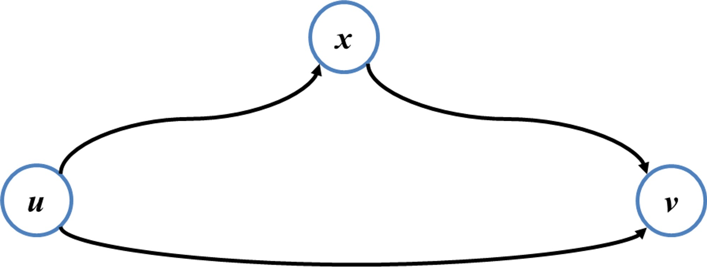

# 3. SSP (Single-Source Shortest Path: 단일 출발지 최단 경로)

> Bellman-Ford (벨만-포드), Dijkstra (다익스트라)

- $G=(V, E)$ → 가중치 방향 그래프

  - 경로 가중치: 경로를 이루는 edge의 가중치 합

 

- Optimal Substructure (최적 부분 구조) 만족 → 동적 프로그래밍 적용

  > 증명: **u~v 모든 경로 중 하나가 최단 경로라면 그 경로의 모든 부분 경로는 최단 경로다.**
  >
  > p: u~v 모든 경로 중 하나가 최단 경로다.  
  > ~q: 그 경로의 어떤 부분 경로는 최단 경로가 아니다.
  >
  > p를 δ(u, v), p'를 p의 부분 경로라고 할 때  
  > 만약 p'이 Optimal Substructure가 아니라면,  
  > 해당 p`보다 더 짧은 p``가 존재한다는 뜻이다.
  >
  > p는 최단 경로가 돼야 하므로 p``를 p에 포함해야 하고,   
이는 초기에 설정했던 p`는 더 이상 최단 경로가 되지 못 한다는 뜻이다.
  >
  > **⇒ 최단 경로의 길이는 그래프 내 다른 노드를 거쳐서 오는 모든 경로보다 같거나 작다.**

 

- Triangle Inequality (삼각 부등식)
  > 증명: **임의의 간선 (u, v) ∈ E가 존재하고 δ(u, v) ≤ δ(u, x) + δ(x, v)이다.**
  >
  > 
  >
  > p: 임의의 간선 (u, v) ∈ E가 존재한다.  
  > ~q: δ(u, v) > δ(u, x) + δ(x, v)이다.
  >
  > u~v 최단 경로의 가중치는 u~x~v 경로의 가중치보다 크다.  
  > 따라서 x를 거쳐 가는 것이 더 적은 비용 들기 때문에  
  > 기존의 δ(u, v)는 더 이상 최단 경로가 아니다.
