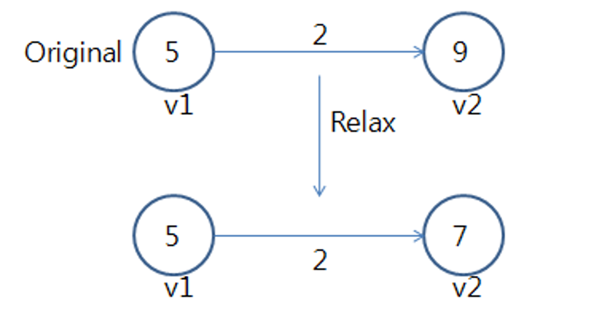

## Bellman-Ford (벨만-포드)

- edge 이용 → relax (최단 경로 추정 값 누적 결과)  
  
- 음수 가중치 O, Negative 사이클 → 최단 거리 존재 X
  - d[v]: δ(s, v) → 시작 노드~v 최단 거리
  - 1번: 최대 n-1번 반복 시 무조건 시작 노드와 연결된 edge 최단 거리 값 업데이트 가능

```
Relax(u, v, w)
if d[v] > d[u] + w // 원래 v의 값과 (u, v)를 통해 가는 값 비교
	d[v] = d[u] + w // 더 작다면 업데이트
// O(1)
```

```
Bellman-Ford()
for 각각의 정점 v ∈ V // 모든 노드에 대해
	d[v] = ∞ // 최단 거리 초기화
d[s] = 0 // 시작 노드 s~s (간선 개수: 0)
// O(n)

for i = 1 to |V| - 1 // edge 1개, 2개 ... n-1개 사용 → O(n)
	for 각 간선 (u, v) ∈ E // edge 순서 모름 (시작 노드에 따라 달라짐) → O(m)
		Relax(u, v, w(u, v)) // 최단 거리 값 업데이트 → O(1)
// O(n×m)

for 각 간선 (u, v) ∈ E // 모든 edge에 대해 → O(m)
	if d[v] > d[u] + w(u, v) // 다시 확인 (최단 거리보다 더 작은 값이 나온다면)
		return "no solution" // negative 사이클 존재 (최단 거리 찾을 수 X)
// O(m)
```

— Prim 활용 —

```
*Q = G.V // 트리에 들어가지 X 노드 집합 (V-S)
// O(n)

for 각각의 u ∈ G.V // 모든 노드에 대해
	key[u] = ∞ // w(u, v)의 최솟값
// O(n)

key[r] = 0 // r~r (가중치: 0)
p[r] = NIL // 어떤 edge를 사용해서 r까지 왔는지
// O(1)

while Q ≠ ∅ // 트리가 완성될 때 까지 (모든 노드가 S에 들어갈 때 까지) → O(n)
	u = Extract-Min(Q) // u: V-S의 light edge
	// 배열: O(n) / 최소힙: O(lgn) → O(1)에 찾고 힙 구조 깨졌으므로 재건축
	for 각 v ∈ G.Adj[u] // v: u와 인접한 노드 (S와 V-S의 cross edge) → O(deg(V))
		if 각 v ∈ Q 이고 w(u, v) + d[u] < key[v]
		// V-S에 있고, 더 작은 값으로 갈 수 있다면
			p[v] = u // 직전 노드 설정
			key[v] = w(u, v) + [u] // 최솟값 감소 (Decrease-Key)
			// 배열: O(1) / 최소힙: O(lgn) → 힙 구조 깨졌으므로 재건축*
```

> $O(V×E)=O(n×m)≤(n^3)$  
> $|V|-1≤|E|≤|V|^2$  
> $|V|^2<|E|×|V|≤|V|^3$

> 배열 : $O(V^2)=O(n^2)$  
> 최소힙: $O(Elgn)=O(mlgn)$  
> 피보나치 힙: $O(Vlgn + E)$  
> $|V|-1≤|E|≤|V|^2$
