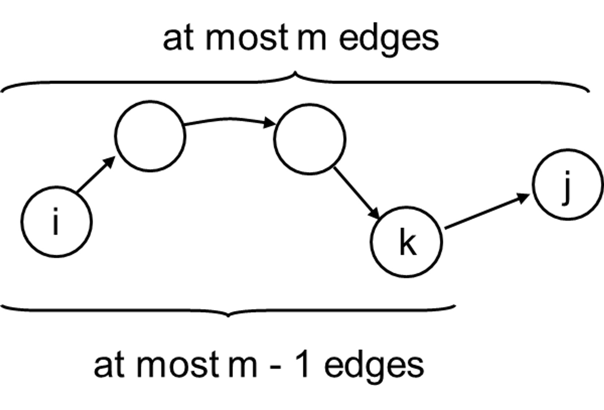
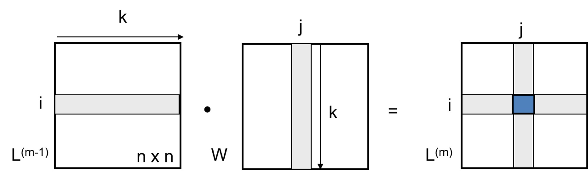

# 4. APSP(All-Pairs Shortest Paths: 모든 쌍의 최단 경로)

> FLOYD-WARSHALL(플로이드-워샬)

- p: i~j 사이 최단 경로 → 최대 m개 edge
  
  - $δ(i, j) = δ(i, k) + w_{kj}$

<br>

- 행렬 곱
  $l_{ij}=min\{\ l_{ij}(m-1), min_{(1≤k≤n)}\{l_{ik}(m-1)+W_{kj}\}\ \}$
  $l_{ij}(m)=min_{(1≤k≤n)}\{l_{ik}(m-1)+W_{kj}\}$ (k → i, j 포함)
  $l_{ij}(m)$ : i~j까지 최대 m개 간선 갖는 모든 경로의 최소 가중치
  $l_{ij}(m-1)$ : $l_{ij}(m)$의 이전 단계
  → k=1~n까지 인접행렬 $l$과 가중치 인접행렬 $W$ 행렬곱
  

<br>

$L(1)=W$  
$L(2)=L(1)×W=W^2$  
$L(3)=L(2)×W=W^3$  
$L(n-1)=L(n-2)×W=W^{n-1}$ → 목표 (최대 edge 개수만큼)

<br>

```
Extend(L, W, n) → O(n^3)

L' = l_{ij}'를 새로운 n×n 행렬이라 한다. // 2차원 배열
for i = 1 to n // n번 반복
	for j = 1 to n // n번 반복
		l_{ij}'= ∞ // 최단 경로 값 초기화
		for k = 1 to n // n번 반복
			l_{ij}' = min {l_{ij}', l_{ik} + w_{kj}} // δ(i, j) = δ(i, k) + w_{kj}
return L` // L(m): 특정 m에 대해 모든 i, j 계산 (최단 경로 X)
```

<br>

```
SLOW-APSP(W, n) // O(n^4)

L(1) = W // L_{ij} = W_{ij} 초기화 (edge 1개 사용하므로 가중치와 동일)
	for m = 2 to n-1 // n-1까지 계산 → O(n)
		L(m) = EXTEND(L(m - 1), W, n) // O(n^3)
 return L(n-1) // 최단 경로 값

BUT!
for i = 1 to n // 모든 경로에 대해 → O(n)
	Bellma-Ford() // O(n×m)
// O(n^2×m)≤O(n^4)
```

⇒ 굳이 SLOW-APSP 쓸 필요 X

<br>

- 수행 시간 개선 → Optimal Substructure + Triangle Inequality

  - 모든 L(m) 계산할 필요 X

    ex) i → x : edge 2개

    x → j : edge 2개

    ⇒ i → j : edge 4개

      <br>

    - $L(m)=L(n-1)\ \ for\ all\ \ m ≥ n-1$ (Negative 사이클 X)  
      $L(1)=W$  
      $L(2)=W^2=W×W$  
      $L(4)=W^4=W^2×W^2$  
      $L(8)=W^8=W^4×W^4$  
      → $2, 4, 8, 16 \ ...=2^1, 2^2, 2^3 \ ...\ 2^k=n-1$  
      $k=\log_2(n-1)$만큼 반복  
      ⇒ $L(n-1)=W^{2^{\log_2(n-1)}}$ → 목표

<br>

```
Extend(L, W, n) // O(n^3)

L' = l_{ij}'를 새로운 n×n 행렬이라 한다. // 2차원 배열
for i = 1 to n // n번 반복
	for j = 1 to n // n번 반복
		l_{ij}'= ∞ // 최단 경로 값 초기화
		for k = 1 to n // n번 반복
			l_{ij}' = min {l_{ij}', l_{ik} + w_{kj}} // δ(i, j) = δ(i, k) + w_{kj}
return L` // L(m): 특정 m에 대해 모든 i, j 계산 (최단 경로 X)
```

```
FASTER-APSP(W, n) // O(n^3lgn)
L(1) = W // L_{ij} = W_{ij} 초기화 (edge 1개 사용하므로 가중치와 동일)
m = 1
while m < n-1 // \log_2n만큼 반복 → O(lgn)
	L(2m) = EXTEND(L(m), L(m), n) // O(n^3)
	m = 2m // m은 2배씩 늘어남
return L(m) // 최단 경로 값
```

> Extend : $O(n^3)$  
> SLOW-APSP : $O(n^4)$  
> FASTER-APSP : $O(n^3lgn)$
