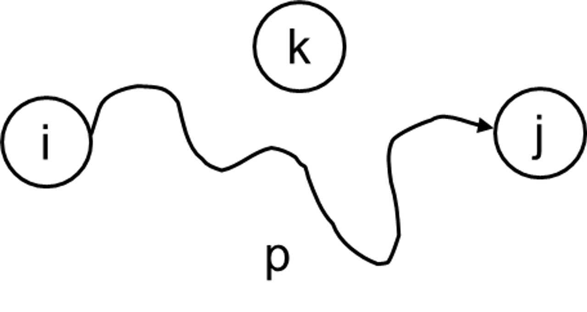
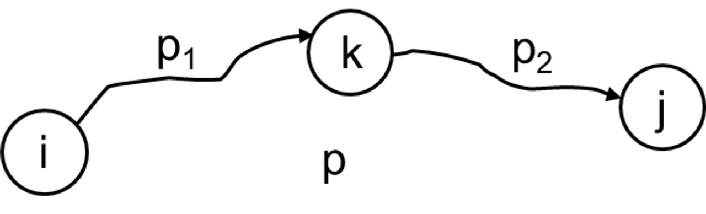
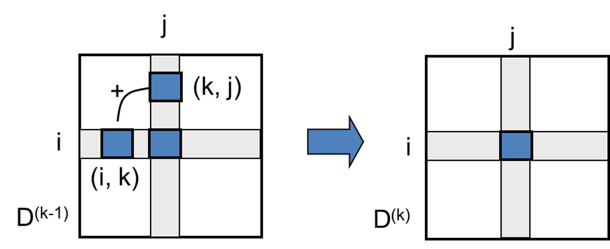

## FLOYD-WARSHALL(플로이드-워샬)

- 방향 가중치 그래프
- 음수 가중치 O, negative 사이클 X

<br>

- $d_{ij}(k)$: intermediate vertex k까지 고려한 최단 거리 경로 값
- intermediate vertex (중간 정점): p 경로 중 i (출발지), j (목적지) 제외 노드

  - p=<i, 1, 2, ... k, j> → {1, 2, ... k}

    - k ≤ index는 고려하지 X
    - edge : 1 + (k-1) + 1 = k+1개

    <br>

  - k가 p의 중간 정점이 아닐 때

    - $p$=<i, 1, 2, ... k-1, j> → {1, 2, ... k-1}
      
      $d_{ij}(k)=d_{ij}(k-1)$ → 이전 계산 값 그대로

    <br>

  - k가 p의 중간 정점일 때
    - $p_1$={1, 2, … k - 1} , $p_2$={1, 2, … k - 1} (k는 $p_1, p_2$의 중간 정점 X)
      
      $d_{ij}(k)=d_{ik}(k-1)+d_{kj}(k)$ → k를 거치지 않은 것과 거치는 것 중 더 작은 값으로

<br>

- 상향식 계산
  $d_{ij}(k)=min\{{d_{ij}(k-1), d_{ik}(k-1) + d_{kj}(k-1)}\}$
  
  ⇒ 경유지를 기준으로, 어떤 두 정점이 해당 경유지를 거쳐갈 경우  
  → 기존의 거리보다 더 짧다면 기존의 거리 값을 갱신

```
FLOYD-WARSHALL(W)
n = rows[W]
D(0) = W // 처음에는 가중치로
// O(1)

for k = 1 to n // n번 반복
	for i = 1 to n  // n번 반복
		for j = 1 to n  // n번 반복
			d_{ij}(k) = min{d_{ij}(k-1), d_{ik}(k-1) + d_{kj}(k-1)} // O(1)
			// k를 거치지 않는 것과 거치는 것 중 더 작은 값으로 설정
 return D(n) // d_{ij}(n)
```

> $O(n^3)$
